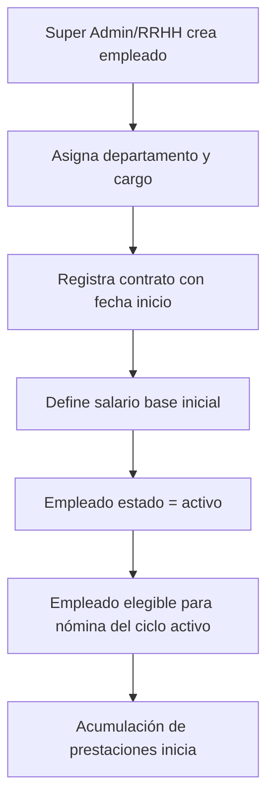
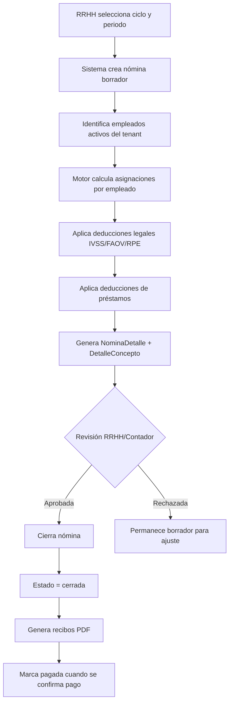
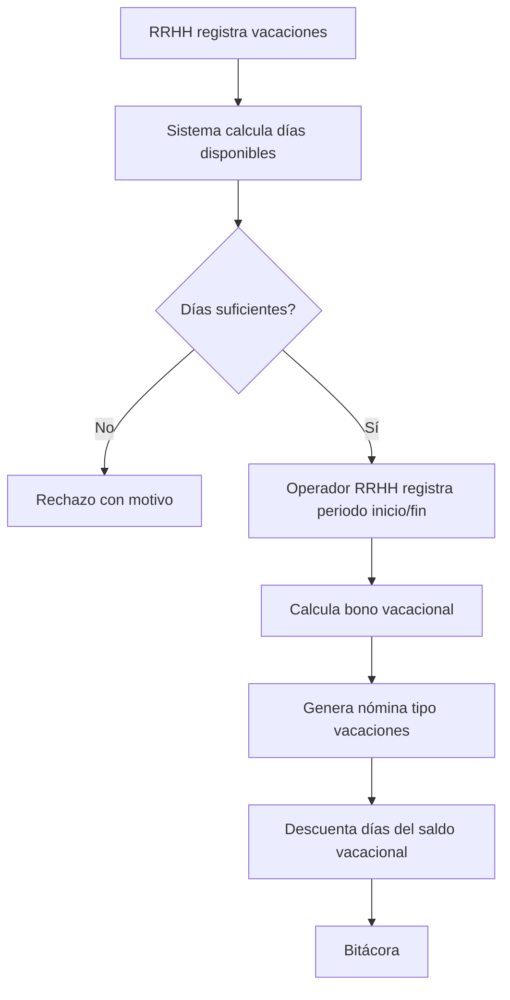
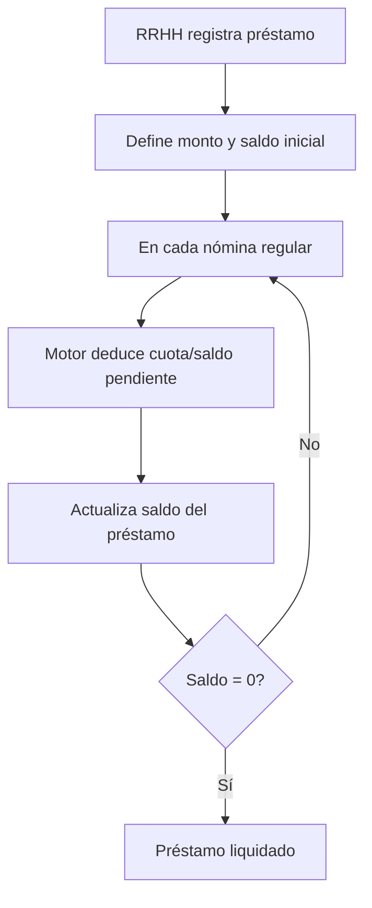
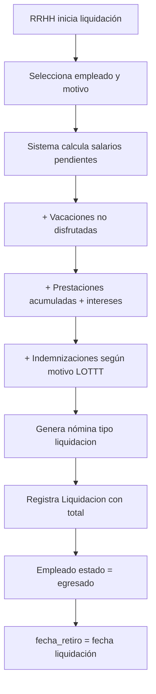
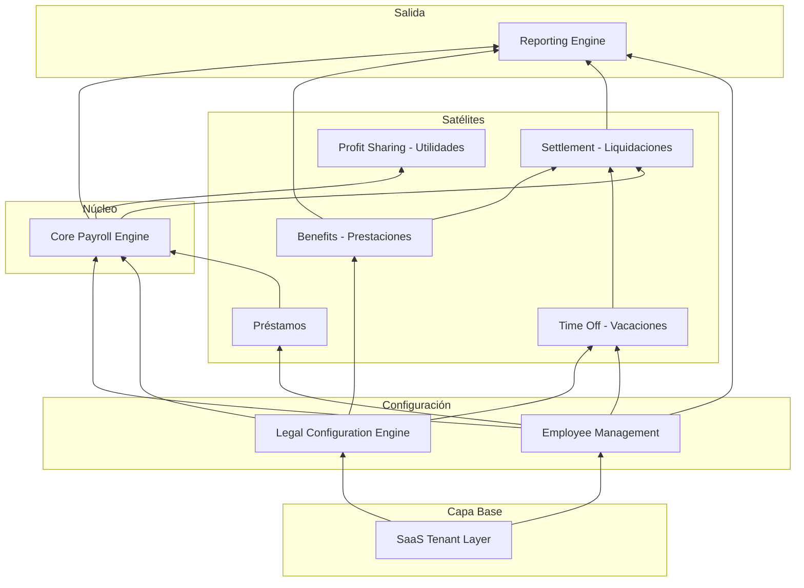

# Especificación de Requerimientos del Software (ERS / SRS)
## Sistema de Nómina Venezuela SaaS — LOTTT

**Versión:** 1.1  
**Fecha:** 22 de junio de 2026  
**Fuentes de verdad analizadas:** PRD v1.1, ERD (Mermaid), SQL Schema  
**Alcance del documento:** Análisis funcional, arquitectura de dominio y planificación — sin implementación técnica  
**Modelo operativo:** Operación centralizada por usuarios de plataforma (Super Admin, RRHH, Contador). Empresas clientes y trabajadores no acceden al sistema.

---

# 1. Visión General del Sistema

## 1.1 Descripción del sistema

Sistema SaaS multiempresa para la gestión integral de nómina en Venezuela, alineado con la Ley Orgánica del Trabajo, los Trabajadores y las Trabajadoras (LOTTT). La plataforma es operada **exclusivamente por usuarios de plataforma** (Super Admin y operadores autorizados). Las **empresas clientes** son registros de negocio; **no tienen acceso administrativo** ni usuarios propios.

Permite al operador de plataforma gestionar el ciclo de vida laboral de empleados por empresa cliente, ejecutar cálculos de nómina con distintas frecuencias de pago, acumular prestaciones sociales, gestionar vacaciones, distribuir utilidades y procesar liquidaciones finales.

El producto se concibe como un **monolito modular** con aislamiento lógico por `empresa_id` (empresa cliente), orientado a escalabilidad progresiva como plataforma SaaS de operación centralizada.

## 1.2 Objetivo SaaS

| Dimensión | Objetivo |
|-----------|----------|
| **Negocio** | Centralizar la nómina venezolana en una plataforma confiable, auditable y conforme a LOTTT |
| **Técnico** | Arquitectura modular que permita evolucionar módulos independientes sin reescritura |
| **Operativo** | Reducir errores manuales en cálculos legales (IVSS, FAOV, RPE, prestaciones, utilidades) |
| **Comercial** | Soportar múltiples empresas clientes con configuraciones independientes, gestionadas centralmente |
| **Operativo** | Una sola capa de administración para todas las empresas clientes |

## 1.3 Alcance funcional

- Autenticación, autorización y auditoría
- Gestión de empresas (tenants) y configuración legal
- Gestión de empleados, departamentos y cargos
- Configuración de ciclos de pago (semanal, quincenal, mensual)
- Motor de nómina con conceptos configurables (asignaciones/deducciones)
- Prestaciones sociales con acumulación e intereses
- Vacaciones y bono vacacional
- Utilidades anuales
- Liquidaciones por renuncia o despido
- Reportes legales en PDF y Excel (generados y entregados por operadores)

## 1.4 Limitaciones del sistema (según artefactos actuales)

- **No hay modelo de suscripciones/planes SaaS** definido en ERD ni SQL (solo mencionado en PRD).
- **Parámetros legales** (`PARAMETRO_EMPRESA`) existen en ERD pero **no están modelados en SQL**.
- **Contratos e histórico salarial** existen en ERD pero **no están en SQL**; el salario vive directamente en `empleados`.
- **Utilidades** tienen módulo en PRD pero **no tienen entidad dedicada**; solo aparecen como `tipo` de nómina.
- **Prestaciones trimestrales** están descritas en PRD pero el SQL modela un registro plano (`acumulado`, `intereses`).
- **Inmutabilidad de nómina** declarada en PRD pero el SQL permite estados editables (`borrador` → `cerrada` → `pagada`) sin mecanismo de versionado explícito.
- **Alcance LOTTT completo** no está detallado (solo IVSS, FAOV, RPE como deducciones explícitas).
- **Integraciones externas** (bancos, IVSS en línea, SUNAGRO, etc.) no están contempladas.

---

# 2. Alcance Funcional (Scope)

## 2.1 Qué incluye el sistema

| Área | Inclusión |
|------|-----------|
| Multi-tenancy | Aislamiento por `empresa_id` en entidades operativas |
| Roles de plataforma | Super Admin, RRHH, Contador (vía Spatie Permission) |
| Empresas clientes | Registros de negocio sin acceso al sistema |
| Empleados (nómina) | Registros laborales; no son usuarios del sistema |
| Empleados | Alta, modificación, estados laborales, organización por depto/cargo |
| Nómina | Generación por ciclo, desglose por conceptos, estados de ciclo |
| Deducciones legales | IVSS, FAOV, RPE (parametrizables por empresa) |
| Prestaciones | Acumulación, intereses, historial |
| Vacaciones | Solicitud, cálculo de días, bono vacacional |
| Préstamos | Registro, saldo pendiente, deducción en nómina |
| Permisos laborales | Registro de ausencias/permisos |
| Liquidaciones | Cálculo integral al egreso |
| Utilidades | Distribución anual configurable |
| Reportes | Recibos PDF, reportes legales, exportación Excel |
| Auditoría | Bitácora de acciones por usuario |

## 2.2 Qué NO incluye el sistema

- Facturación SaaS, cobros recurrentes y gestión de planes (pendiente de diseño)
- Contabilidad general / integración contable completa
- Control de asistencia biométrico o reloj checador
- Gestión de reclutamiento y selección de personal
- Nómina de contratistas independientes (solo relación laboral dependiente implícita)
- Declaraciones electrónicas ante organismos gubernamentales
- Multi-moneda o conversión cambiaria (salarios en moneda local implícita)
- App móvil nativa (portal web responsive es el alcance implícito)
- Firma digital de documentos legales
- Portal del empleado o autoservicio para trabajadores
- Usuarios administrativos por empresa cliente (Admin Empresa)
- Login de empresas clientes o empleados en nómina

---

# 3. Stakeholders y Roles

> **Principio:** Solo **usuarios de plataforma** autentican en el sistema. Las empresas clientes y los empleados en nómina **no tienen acceso** ni credenciales.

## 3.1 Super Admin

**Alcance:** Plataforma SaaS completa  
**Responsabilidades:**

- Crear, activar y desactivar empresas clientes
- Gestionar usuarios de plataforma y asignar roles/permisos (Spatie)
- Configurar empresas clientes: datos fiscales, parámetros legales, ciclos de pago, departamentos y cargos
- Administrar conceptos de nómina globales (si aplica)
- Supervisar bitácora global
- Configurar parámetros de plataforma (futuro: planes SaaS)
- Operar o delegar toda la gestión de nómina de empresas clientes

## 3.2 RRHH (operador de plataforma)

**Alcance:** Operaciones de personal y nómina sobre empresas clientes (según permisos Spatie)  
**Responsabilidades:**

- Alta, modificación y baja de empleados por empresa cliente
- Gestionar contratos y cambios salariales
- Generar y cerrar nóminas
- Procesar vacaciones, permisos laborales y préstamos
- Iniciar liquidaciones
- Consultar prestaciones acumuladas
- Generar y entregar recibos PDF a empresas clientes

**Restricciones:** Acceso limitado por permisos asignados por Super Admin; no administra usuarios ni roles.

## 3.3 Contador (operador de plataforma)

**Alcance:** Consulta y reportes sobre empresas clientes (según permisos Spatie)  
**Responsabilidades:**

- Generar reportes legales (PDF/Excel)
- Verificar totales de nómina, deducciones y prestaciones
- Auditar cálculos antes de cierre contable externo
- Exportar información para libros auxiliares

**Restricciones:** Lectura y exportación; modificación limitada según permisos.

## 3.4 Empresa cliente (sin acceso al sistema)

**Alcance:** Entidad de negocio registrada en la plataforma  
**Responsabilidades:** Ninguna dentro del sistema; es objeto de gestión por operadores de plataforma.

**Restricciones:** No inicia sesión, no administra datos, no tiene usuarios propios.

## 3.5 Empleado en nómina (sin acceso al sistema)

**Alcance:** Registro laboral asociado a una empresa cliente  
**Responsabilidades:** Ninguna dentro del sistema; su información es gestionada por operadores de plataforma.

**Restricciones:** No es usuario del sistema; no existe portal del empleado. Recibos y comunicaciones se entregan fuera del sistema por los operadores.

---

# 4. Arquitectura Funcional (NO técnica)

## 4.1 Autenticación y Seguridad

- Auth Breeze solo para **usuarios de plataforma**
- Asignación de roles y permisos granulares (Spatie)
- Sesiones seguras con expiración
- Política de contraseñas
- Aislamiento de datos por `empresa_id` (empresa cliente) en cada operación
- Super Admin gestiona usuarios, roles y permisos

## 4.2 Gestión de Empresas (clientes)

- CRUD de empresas clientes con datos fiscales (RIF, razón social) — operado por Super Admin / operadores autorizados
- Activación/desactivación de empresa cliente
- Configuración de parámetros legales con vigencia histórica
- Definición de ciclos de pago por empresa cliente

## 4.3 Gestión de Empleados

- Registro demográfico y laboral (cédula, nombres, fechas)
- Asignación a departamento y cargo
- Estados: activo, suspendido, egresado
- Relación con contrato e histórico salarial (requerido por ERD, pendiente en SQL)

## 4.4 Motor de Nómina

- Catálogo de conceptos (asignación/deducción) con fórmulas
- Cálculo por empleado según salario base y parámetros legales
- Desglose en `detalle_conceptos`
- Agregación en totales por empleado y por nómina
- Tipos: regular, vacaciones, utilidades, liquidación

## 4.5 Ciclos de Pago

- Configuración de frecuencia: semanal (7), quincenal (15), mensual (30) días
- Múltiples ciclos activos por empresa (si se requiere)
- Vinculación nómina ↔ ciclo ↔ rango de fechas (`desde`/`hasta`)

## 4.6 Prestaciones Sociales

- Acumulación periódica (trimestral según PRD)
- Cálculo de intereses sobre saldo acumulado
- Historial de movimientos (requiere enriquecimiento del modelo actual)
- Consulta de saldo disponible y pagado

## 4.7 Vacaciones

- Cálculo automático de días según antigüedad (LOTTT)
- Registro de periodos disfrutados
- Generación de bono vacacional como nómina tipo `vacaciones`
- Impacto en nómina regular (días no trabajados)

## 4.8 Utilidades

- Configuración anual por empresa (% utilidades, base de cálculo)
- Distribución proporcional entre empleados activos
- Generación de nómina tipo `utilidades`
- Registro histórico por ejercicio fiscal

## 4.9 Liquidaciones

- Disparador: renuncia o despido (motivo registrado)
- Cálculo integral: salarios pendientes, vacaciones no disfrutadas, prestaciones, indemnizaciones aplicables
- Generación de nómina tipo `liquidacion`
- Cierre del empleado (`estado = egresado`, `fecha_retiro`)

## 4.10 Reportes

- Recibo de pago individual (PDF)
- Nómina consolidada por periodo
- Reportes de deducciones legales (IVSS, FAOV, RPE)
- Reporte de prestaciones acumuladas
- Exportación Excel para análisis externo

## 4.11 Auditoría

- Registro de acciones críticas: login, CRUD empleados, generación/cierre nómina, cambios de parámetros
- Trazabilidad: quién, qué, cuándo
- Consulta filtrable por usuario y rango de fechas

---

# 5. Modelo de Dominio

## 5.1 Entidades principales

| Entidad | Descripción funcional |
|---------|----------------------|
| **Empresa** | Empresa cliente; tenant de datos; agrupa operación; sin acceso al sistema |
| **Usuario** | Operador de plataforma autenticado (Super Admin, RRHH, Contador) |
| **Rol** | Conjunto de permisos Spatie para operadores de plataforma |
| **Departamento** | Unidad organizativa dentro de la empresa cliente |
| **Cargo** | Puesto de trabajo; define rol laboral |
| **Empleado** | Registro laboral en nómina; **no es usuario del sistema** |
| **CicloPago** | Frecuencia y duración del periodo de pago |
| **ParametroEmpresa** | Variables legales con vigencia (salario mínimo, % IVSS/FAOV/RPE, valor UT) |
| **Contrato** | Relación laboral formal con fechas de inicio/fin |
| **HistoricoSalario** | Evolución salarial vinculada al contrato |
| **Nomina** | Corrida de pago para un periodo y tipo |
| **NominaDetalle** | Resultado de cálculo por empleado en una nómina |
| **ConceptoNomina** | Rubro de asignación o deducción con fórmula |
| **DetalleConcepto** | Monto aplicado de un concepto a un empleado |
| **Vacacion** | Periodo de descanso solicitado/disfrutado |
| **Permiso** | Ausencia autorizada (diferente de permisos RBAC) |
| **Prestamo** | Anticipo o préstamo con saldo deducible |
| **Prestacion** | Acumulado de prestaciones sociales + intereses |
| **Liquidacion** | Pago final al egreso del empleado |
| **Bitacora** | Registro de auditoría |

## 5.2 Relaciones críticas

```
Empresa ──1:N──► Empleado, Departamento, Cargo, CicloPago, Nomina, ParametroEmpresa
Empleado ──1:1──► Contrato (ERD) ──1:N──► HistoricoSalario
Empleado ──1:N──► NominaDetalle, Vacacion, Permiso, Prestamo, Prestacion, Liquidacion
CicloPago ──1:N──► Nomina
Nomina ──1:N──► NominaDetalle ──1:N──► DetalleConcepto ──N:1──► ConceptoNomina
Usuario ──N:M──► Rol
Usuario ──1:N──► Bitacora
```

**Regla transversal:** Todo dato operativo pertenece a una `empresa_id` (empresa cliente). Los operadores de plataforma acceden según permisos Spatie; las operaciones sobre datos de empresa cliente deben filtrarse por la empresa en contexto. El Super Admin tiene acceso global.

## 5.3 Reglas de negocio importantes del dominio

1. Un empleado pertenece a una sola empresa; su cédula debe ser única dentro del tenant.
2. Solo empleados en estado `activo` o `suspendido` participan en nómina regular; `egresado` excluido.
3. Una nómina cerrada o pagada no admite recálculo; correcciones requieren nómina complementaria o reversión controlada (a definir).
4. Los conceptos de deducción legal (IVSS, FAOV, RPE) dependen de `ParametroEmpresa` vigente en la fecha del periodo.
5. El salario base para cálculos proviene del contrato vigente o histórico salarial (ERD), no necesariamente del campo directo en empleado.
6. Prestaciones se acumulan de forma continua/trimestral y generan intereses según LOTTT.
7. Vacaciones generan derecho a días y bono vacacional proporcional.
8. Préstamos reducen saldo en cada nómina hasta liquidación del saldo.
9. Liquidación consolida todos los conceptos pendientes y cierra la relación laboral.
10. Ciclos de pago determinan el rango `desde`/`hasta` de cada nómina regular.

---

# 6. Flujos de Negocio Principales

## 6.1 Ciclo de contratación de empleado



**Actores:** Super Admin, RRHH (operador de plataforma)  
**Entidades tocadas:** Empleado, Contrato, HistoricoSalario, Prestacion  
**Precondiciones:** Empresa activa, departamento/cargo existentes, ciclo de pago configurado  
**Postcondiciones:** Empleado activo, bitácora registrada

## 6.2 Ciclo de nómina semanal / quincenal / mensual



**Variantes por frecuencia:** Solo cambia `dias` del ciclo y el rango de fechas; el motor es el mismo.

## 6.3 Flujo de vacaciones



## 6.4 Flujo de préstamos



## 6.5 Flujo de liquidación



---

# 7. Reglas de Negocio del Sistema

| ID | Regla | Fuente |
|----|-------|--------|
| RN-01 | Todo dato operativo pertenece a un `empresa_id` (empresa cliente); ninguna operación cruza empresas clientes | PRD, SQL |
| RN-02 | Ciclos de pago son configurables por empresa cliente (nombre, días, activo) | PRD, ERD, SQL |
| RN-03 | Nómina es inmutable una vez cerrada o pagada | PRD |
| RN-04 | Toda acción crítica genera registro en bitácora | PRD |
| RN-05 | Parámetros legales son dinámicos y tienen vigencia por fecha | ERD |
| RN-06 | Prestaciones son acumulativas con intereses periódicos | PRD |
| RN-07 | Deducciones IVSS, FAOV y RPE se calculan sobre base imponible según parámetros vigentes | PRD |
| RN-08 | Un empleado egresado no participa en nóminas regulares futuras | SQL (estado) |
| RN-09 | Nómina puede ser de tipo: regular, vacaciones, utilidades, liquidación | SQL |
| RN-10 | Estados de nómina: borrador → cerrada → pagada | SQL |
| RN-11 | Solo usuarios de plataforma autentican; Super Admin tiene control global | PRD |
| RN-12 | Cédula de empleado debe ser única por empresa cliente | Implícito |
| RN-13 | Conceptos de nómina pueden tener fórmulas configurables | ERD, SQL |
| RN-14 | Préstamos reducen saldo en nómina hasta agotarse | Dominio |
| RN-15 | Liquidación obliga cierre del ciclo laboral del empleado | Dominio |
| RN-16 | Empresas clientes no tienen acceso administrativo al sistema | PRD |
| RN-17 | Empleados en nómina no son usuarios del sistema; no existe portal del empleado | PRD |
| RN-18 | Permisos definidos vía Spatie; Super Admin administra roles y asignaciones | PRD |

---

# 8. Requerimientos Funcionales (RF)

## Autenticación y seguridad

**RF-01.** El sistema debe permitir inicio de sesión de **usuarios de plataforma** con credenciales email/contraseña.  
**RF-02.** El sistema debe asignar uno o más roles Spatie a cada usuario de plataforma.  
**RF-03.** El sistema debe restringir el acceso a funcionalidades según rol y permisos del operador autenticado.  
**RF-04.** El Super Admin debe poder acceder a funciones globales de la plataforma.  
**RF-05.** Los operadores de plataforma solo deben acceder a empresas clientes y acciones permitidas por sus permisos Spatie.

## Gestión de empresas

**RF-06.** El Super Admin (u operador autorizado) debe poder crear empresas clientes con razón social, RIF, contacto y dirección.  
**RF-07.** El RIF de empresa cliente debe ser único en la plataforma.  
**RF-08.** El Super Admin debe poder activar/desactivar empresas clientes.  
**RF-09.** El Super Admin u operador autorizado debe configurar parámetros legales por empresa cliente: salario mínimo, % IVSS, % FAOV, % RPE, valor UT, con fecha de vigencia.  
**RF-10.** El sistema debe resolver el parámetro legal vigente para una fecha de nómina dada.

## Organización

**RF-11.** El sistema debe permitir CRUD de departamentos por empresa.  
**RF-12.** El sistema debe permitir CRUD de cargos por empresa.  
**RF-13.** Departamentos y cargos deben estar scoped a `empresa_id`.

## Empleados

**RF-14.** El sistema debe permitir registrar empleados con cédula, nombres, apellidos, fechas de ingreso/retiro y salario base.  
**RF-15.** El sistema debe asignar empleado a departamento y cargo opcionales.  
**RF-16.** El sistema debe gestionar estados laborales: activo, suspendido, egresado.  
**RF-17.** El sistema debe registrar contrato laboral con fechas de inicio y fin (requerido por ERD).  
**RF-18.** El sistema debe mantener histórico de cambios salariales vinculados al contrato.  
**RF-19.** La cédula del empleado debe ser única dentro de la empresa.

## Ciclos de pago

**RF-20.** El Super Admin u operador autorizado debe definir ciclos de pago por empresa cliente con nombre, cantidad de días y estado activo.  
**RF-21.** El sistema debe soportar ciclos semanal (7), quincenal (15) y mensual (30) días como presets.  
**RF-22.** Una empresa puede tener múltiples ciclos definidos, con al menos uno activo para operar nómina.

## Motor de nómina

**RF-23.** El sistema debe mantener un catálogo de conceptos de nómina clasificados como asignación o deducción.  
**RF-24.** Cada concepto puede tener una fórmula de cálculo asociada.  
**RF-25.** El operador RRHH debe poder generar una nómina seleccionando empresa cliente, ciclo, rango de fechas y tipo.  
**RF-26.** El motor debe calcular, por cada empleado elegible, total asignaciones, total deducciones y neto.  
**RF-27.** El motor debe desglosar cada monto en detalle por concepto.  
**RF-28.** El sistema debe calcular automáticamente deducciones IVSS, FAOV y RPE según parámetros vigentes.  
**RF-29.** El RRHH debe poder revisar nómina en estado borrador antes de cerrarla.  
**RF-30.** Al cerrar nómina, el sistema debe impedir modificaciones al cálculo (inmutabilidad).  
**RF-31.** El sistema debe permitir marcar nómina como pagada tras confirmación de desembolso.  
**RF-32.** El sistema debe soportar nóminas de tipo regular, vacaciones, utilidades y liquidación.

## Prestaciones sociales

**RF-33.** El sistema debe acumular prestaciones sociales por empleado de forma periódica (trimestral según PRD).  
**RF-34.** El sistema debe calcular y registrar intereses sobre el acumulado de prestaciones.  
**RF-35.** El sistema debe mantener historial consultable de movimientos de prestaciones.  
**RF-36.** El operador RRHH debe consultar saldo actual de prestaciones por empleado.

## Vacaciones

**RF-37.** El sistema debe calcular automáticamente días de vacaciones según antigüedad (LOTTT).  
**RF-38.** El operador RRHH debe registrar vacaciones con fechas inicio, fin y días.  
**RF-39.** El sistema debe validar que los días registrados no excedan el saldo disponible.  
**RF-40.** El operador RRHH debe calcular y pagar bono vacacional mediante nómina tipo vacaciones.  
**RF-41.** El RRHH debe registrar permisos laborales (ausencias) con fecha y tipo.

## Préstamos

**RF-42.** El RRHH debe registrar préstamos con monto inicial y saldo.  
**RF-43.** El motor de nómina debe deducir del saldo del préstamo en cada corrida regular.  
**RF-44.** El sistema debe impedir deducciones superiores al saldo pendiente.  
**RF-45.** El operador RRHH debe consultar saldo de préstamos activos por empleado.

## Utilidades

**RF-46.** El Super Admin u operador autorizado debe configurar parámetros de distribución de utilidades anuales por empresa cliente.  
**RF-47.** El sistema debe calcular monto de utilidades por empleado según criterio configurado.  
**RF-48.** El sistema debe generar nómina tipo utilidades con desglose por empleado.  
**RF-49.** El sistema debe conservar historial de utilidades por ejercicio.

## Liquidaciones

**RF-50.** El RRHH debe iniciar liquidación indicando empleado, motivo (renuncia/despido) y fecha.  
**RF-51.** El sistema debe calcular automáticamente: salarios pendientes, vacaciones, prestaciones, indemnizaciones aplicables.  
**RF-52.** El sistema debe generar nómina tipo liquidación con el desglose completo.  
**RF-53.** Al completar liquidación, el empleado debe pasar a estado egresado con fecha de retiro.  
**RF-54.** El sistema debe registrar el total de pago en entidad Liquidacion.

## Reportes

**RF-55.** El operador RRHH o Contador debe poder generar recibo de pago individual en PDF por empleado y nómina para entrega externa.  
**RF-56.** El sistema debe generar reporte consolidado de nómina por periodo.  
**RF-57.** El sistema debe exportar reportes legales de deducciones en Excel.  
**RF-58.** El Contador debe poder exportar reportes de prestaciones acumuladas.  
**RF-59.** Los reportes deben incluir datos fiscales de la empresa emisora.

## Auditoría

**RF-60.** El sistema debe registrar en bitácora: usuario, acción y timestamp de operaciones críticas.  
**RF-61.** El Super Admin y operadores autorizados deben consultar bitácora filtrada por usuario, fecha y empresa cliente.  
**RF-62.** Operaciones auditables incluyen: login, CRUD empresas clientes, CRUD empleados, generación/cierre de nómina, cambios de parámetros legales, gestión de usuarios de plataforma.

---

# 9. Requerimientos No Funcionales (RNF)

## Performance

**RNF-01.** Generación de nómina para hasta 500 empleados por empresa debe completarse en menos de 60 segundos.  
**RNF-02.** Consultas de listado de empleados deben responder en menos de 2 segundos con paginación.  
**RNF-03.** Índices en `empresa_id` para tablas de alto volumen (empleados, nóminas) — ya contemplado parcialmente en SQL.

## Seguridad

**RNF-04.** Contraseñas almacenadas con hash bcrypt/argon2 (estándar Laravel).  
**RNF-05.** Aislamiento estricto por `empresa_id` en datos de empresas clientes; operadores acceden según permisos Spatie.  
**RNF-06.** Protección CSRF en formularios web.  
**RNF-07.** Rate limiting en autenticación.  
**RNF-08.** Principio de mínimo privilegio en roles.

## Escalabilidad SaaS

**RNF-09.** Arquitectura modular monolith preparada para extracción futura de servicios.  
**RNF-10.** Diseño stateless en capa web para escalado horizontal.  
**RNF-11.** Colas para generación masiva de nómina y reportes PDF (recomendado).  
**RNF-12.** Preparación para modelo de planes/suscripciones (futuro).

## Auditoría

**RNF-13.** Bitácora append-only; no editable por usuarios.  
**RNF-14.** Retención mínima de bitácora: 5 años (recomendado sector nómina).  
**RNF-15.** Bitácora debe incluir contexto de empresa cuando aplique (gap actual en SQL).

## Mantenibilidad

**RNF-16.** Motor de nómina desacoplado del resto de módulos (Nomina Engine).  
**RNF-17.** Parámetros legales externalizados en configuración por empresa, no hardcodeados.  
**RNF-18.** Fórmulas de conceptos evaluables sin redeploy (configuración en BD).  
**RNF-19.** Cobertura de tests en motor de cálculo ≥ 90% (recomendado).

## Compatibilidad

**RNF-20.** Backend: Laravel 13, PHP 8.4+.  
**RNF-21.** Base de datos: MySQL 8+.  
**RNF-22.** Frontend: Blade + TailwindCSS v3 + Alpine.js v3.  
**RNF-23.** Autenticación: Laravel Breeze.  
**RNF-24.** Roles: Spatie Permission (PRD) — requiere reconciliación con SQL actual.  
**RNF-25.** Exportación: DomPDF + Laravel Excel.

## Disponibilidad y confiabilidad

**RNF-26.** Backups diarios de base de datos por tenant o global con restauración probada.  
**RNF-27.** Nóminas cerradas deben ser recuperables ante fallo; transacciones atómicas en generación.

---

# 10. Modularización del Sistema

## 10.1 Core Payroll Engine

**Responsabilidad:** Cálculo de nómina, evaluación de fórmulas, aplicación de deducciones legales, agregación de totales.

**Entidades:** Nomina, NominaDetalle, DetalleConcepto, ConceptoNomina, CicloPago

**Interfaces expuestas:**

- `generarNomina(empresa, ciclo, periodo, tipo)`
- `calcularEmpleado(empleado, parametros, conceptos)`
- `cerrarNomina(nominaId)`
- `aplicarDeduccionesLegales(base, parametros)`

**Depende de:** Legal Configuration Engine, Employee Management

---

## 10.2 Employee Management

**Responsabilidad:** Ciclo de vida del empleado, contratos, histórico salarial, organización.

**Entidades:** Empleado, Contrato, HistoricoSalario, Departamento, Cargo, Vacacion, Permiso, Prestamo

**Interfaces expuestas:**

- `altaEmpleado(datos)`
- `cambiarSalario(empleado, nuevoSalario, fecha)`
- `obtenerEmpleadosActivos(empresa, periodo)`
- `registrarEgreso(empleado, fecha, motivo)`

**Depende de:** SaaS Tenant Layer

---

## 10.3 Legal Configuration Engine

**Responsabilidad:** Parámetros legales vigentes, reglas LOTTT, presets de deducciones.

**Entidades:** ParametroEmpresa, ConceptoNomina (parcial)

**Interfaces expuestas:**

- `obtenerParametrosVigentes(empresa, fecha)`
- `calcularIVSS(base, parametros)`
- `calcularFAOV(base, parametros)`
- `calcularRPE(base, parametros)`
- `calcularPrestaciones(empleado, periodo)`
- `calcularVacaciones(empleado, antiguedad)`

**Depende de:** SaaS Tenant Layer

---

## 10.4 Reporting Engine

**Responsabilidad:** Generación de PDF, Excel, reportes legales consolidados.

**Entidades:** Lectura de Nomina, Prestacion, Liquidacion (sin mutación)

**Interfaces expuestas:**

- `generarReciboPDF(nominaDetalle)`
- `exportarNominaExcel(nomina)`
- `reporteDeduccionesLegales(empresa, periodo)`
- `reportePrestaciones(empresa, fecha)`

**Depende de:** Core Payroll Engine, Employee Management

---

## 10.5 SaaS Tenant Layer

**Responsabilidad:** Multi-tenancy de datos, empresas clientes, usuarios de plataforma, roles Spatie, auditoría, autenticación.

**Entidades:** Empresa, Usuario, Rol, Bitacora

**Interfaces expuestas:**

- `resolverContextoEmpresa(operador, empresaClienteId)`
- `validarAcceso(operador, recurso, empresaCliente)`
- `registrarAuditoria(operador, accion, contexto)`
- `gestionarEmpresaCliente(datos)`
- `gestionarUsuariosPlataforma(datos, roles)`

**Depende de:** Ninguno (capa base)

---

## 10.6 Módulos satélite (bounded contexts adicionales)

| Módulo | Bounded Context | Notas |
|--------|-----------------|-------|
| **Benefits (Prestaciones)** | Prestacion, acumulación, intereses | Puede extraerse del Legal Engine |
| **Settlement (Liquidaciones)** | Liquidacion + orquestación de cálculo final | Orquesta Payroll + Benefits + Vacations |
| **Profit Sharing (Utilidades)** | Configuración y distribución anual | Entidad propia requerida (gap) |
| **Time Off (Vacaciones/Permisos)** | Vacacion, Permiso | Flujo de aprobación |

---

# 11. Roadmap de Implementación (SIN CÓDIGO)

## Fase 1 — Base del sistema

**Objetivo:** Plataforma multi-tenant operativa con seguridad y organización.

**Entregables funcionales:**

- Autenticación (Breeze) + Spatie Permission
- CRUD empresas clientes (Super Admin)
- CRUD usuarios de plataforma y asignación de roles/permisos
- CRUD departamentos y cargos por empresa cliente
- Bitácora básica con contexto de empresa cliente
- Contexto de empresa cliente en operaciones de operadores

**Entidades a consolidar:** Empresa, Usuario, Rol, Departamento, Cargo, Bitacora

**Decisiones de diseño pendientes:**

- Reconciliar `usuarios`/`roles` SQL vs `users`/Spatie
- Añadir `PARAMETRO_EMPRESA` al schema
- Definir política de unicidad cédula por empresa

**Criterio de done:** Super Admin crea empresa cliente, registra operador RRHH con permisos, RRHH opera solo sobre empresas clientes autorizadas.

---

## Fase 2 — Nómina básica

**Objetivo:** Primera corrida de nómina regular funcional.

**Entregables funcionales:**

- CRUD empleados con estados
- Contrato + histórico salarial (cerrar gap ERD/SQL)
- Configuración ciclos de pago
- Catálogo conceptos de nómina
- Motor de nómina: asignaciones + IVSS/FAOV/RPE
- Flujo borrador → cerrada → pagada
- Recibo PDF básico

**Entidades:** Empleado, Contrato, HistoricoSalario, CicloPago, Nomina, NominaDetalle, DetalleConcepto, ConceptoNomina, ParametroEmpresa

**Criterio de done:** RRHH genera nómina quincenal, cierra, exporta recibos PDF.

---

## Fase 3 — Prestaciones y vacaciones

**Objetivo:** Cumplimiento LOTTT en beneficios laborales.

**Entregables funcionales:**

- Acumulación trimestral de prestaciones + intereses
- Historial de movimientos de prestaciones
- Cálculo automático días vacacionales
- Flujo de registro de vacaciones por operador RRHH
- Bono vacacional vía nómina tipo vacaciones
- Registro permisos laborales
- Préstamos con deducción en nómina

**Entidades enriquecidas:** Prestacion (+ movimientos), Vacacion (+ saldo, estado), Prestamo (+ cuotas), Permiso

**Criterio de done:** Operador RRHH registra vacaciones de un empleado y genera bono en nómina tipo vacaciones.

---

## Fase 4 — Liquidaciones

**Objetivo:** Cierre completo de relación laboral.

**Entregables funcionales:**

- Wizard de liquidación por renuncia/despido
- Cálculo integral (salarios + vacaciones + prestaciones + indemnizaciones)
- Nómina tipo liquidación
- Egreso automático del empleado
- Documento PDF de liquidación

**Dependencias:** Fases 2 y 3 completas

**Criterio de done:** Liquidación de empleado con 2 años de antigüedad genera pago correcto y cierra estado.

---

## Fase 5 — Reportes avanzados

**Objetivo:** Satisfacer necesidades del Contador y cumplimiento.

**Entregables funcionales:**

- Reportes legales consolidados (IVSS, FAOV, RPE por periodo)
- Exportación Excel masiva
- Reporte prestaciones por empresa
- Reporte utilidades anuales
- Dashboard KPIs nómina (totales, headcount, costo laboral)

**Dependencias:** Fases 2-4

---

## Fase 6 — Optimización SaaS

**Objetivo:** Producto comercializable y escalable.

**Entregables funcionales:**

- Modelo planes/suscripciones/límites por empresa cliente
- Colas para generación masiva de nómina y PDFs
- Notificaciones email a operadores (nómina generada, vacaciones registradas)
- Cache de parámetros legales
- Health checks y métricas
- Onboarding guiado para configuración inicial de empresa cliente

**Dependencias:** Fases 1-5

---

# 12. Riesgos del Sistema

| ID | Riesgo | Impacto | Probabilidad | Mitigación |
|----|--------|---------|--------------|------------|
| R-01 | **Complejidad legal LOTTT** — interpretación incorrecta de prestaciones, vacaciones, indemnizaciones | Alto | Alta | Validación con contador/abogado laboral; suite de tests con casos reales; parametrización |
| R-02 | **Errores de cálculo de nómina** — montos incorrectos afectan confianza y cumplimiento | Crítico | Media | Motor aislado con tests unitarios exhaustivos; nómina borrador obligatoria; doble revisión |
| R-03 | **Multi-tenant inconsistente** — fuga de datos entre empresas | Crítico | Media | Global scopes, policies, tests de aislamiento, code review estricto |
| R-04 | **Parámetros mal configurados** — % IVSS/FAOV/RPE incorrectos | Alto | Alta | Validación en UI, valores por defecto legales, alertas de vigencia expirada |
| R-05 | **Inconsistencia PRD/ERD/SQL** — implementación sobre schema incompleto | Alto | Alta | Consolidar schema antes de Fase 2; este documento como baseline |
| R-06 | **Inmutabilidad vs estados borrador** — ambigüedad en correcciones post-cierre | Medio | Media | Definir política: nómina complementaria vs reversión |
| R-07 | **Colisión nomenclatura `permisos`** — tabla laboral vs Spatie Permission | Medio | Alta | Renombrar entidad laboral a `permisos_laborales` o `ausencias` |
| R-08 | **Conceptos globales vs por tenant** — SQL sin `empresa_id` en conceptos | Medio | Media | Decidir: catálogo global (Super Admin) o por empresa |
| R-09 | **Escalabilidad generación PDF** — bloqueo en nóminas grandes | Medio | Media | Colas async en Fase 6 |
| R-10 | **Cambios legislativos** — nuevas tasas o conceptos | Alto | Media | Legal Configuration Engine con vigencia histórica |

---

# 13. Dependencias entre Módulos



## Matriz de dependencias

| Módulo | Depende de | Es requerido por |
|--------|-----------|------------------|
| SaaS Tenant Layer | — | Todos |
| Employee Management | SaaS Tenant Layer | Payroll, TimeOff, Loans, Settlement, Reports |
| Legal Configuration Engine | SaaS Tenant Layer | Payroll, Benefits, TimeOff, Settlement |
| Core Payroll Engine | Employee, Legal | Settlement, Utilities, Reports |
| Benefits (Prestaciones) | Legal, Employee | Settlement, Reports |
| Time Off (Vacaciones) | Employee, Legal | Settlement, Payroll |
| Préstamos | Employee | Payroll |
| Settlement (Liquidaciones) | Payroll, Benefits, TimeOff, Employee | Reports |
| Profit Sharing (Utilidades) | Payroll, Legal | Reports |
| Reporting Engine | Payroll, Employee, Benefits, Settlement | — |

**Orden de implementación derivado:**  
SaaS Tenant → Employee + Legal (paralelo) → Payroll → Benefits + TimeOff + Loans (paralelo) → Settlement + Utilities → Reports → Optimización SaaS

---

# Anexo A — Inconsistencias detectadas entre artefactos

Este anexo documenta gaps que deben resolverse antes o durante la implementación:

| # | Inconsistencia | PRD | ERD | SQL | Resolución recomendada |
|---|----------------|-----|-----|-----|------------------------|
| I-01 | Parámetros legales | ✓ implícito | ✓ PARAMETRO_EMPRESA | ✗ ausente | Añadir tabla con vigencia |
| I-02 | Contrato e histórico salarial | ✗ | ✓ | ✗ | Añadir tablas; migrar salario de empleado |
| I-03 | Utilidades como módulo | ✓ | ✗ | parcial (tipo nómina) | Crear entidad configuración utilidades |
| I-04 | Spatie Permission | ✓ | ✗ | roles custom | Adoptar Spatie; deprecar roles SQL |
| I-05 | Prestaciones trimestrales | ✓ | simplificado | simplificado | Modelar movimientos/periodos |
| I-06 | Bono vacacional | ✓ | ✗ campos | ✗ | Campos en vacaciones o via nómina |
| I-07 | Bitácora sin empresa_id | ✓ tenant | ✗ | ✗ | Añadir empresa_id y entidad afectada |
| I-08 | Conceptos sin empresa_id | ✗ | ✗ | global | Definir scope: global vs tenant |
| I-09 | Planes SaaS | ✓ futuro | ✗ | ✗ | Diseñar en Fase 6 |
| I-10 | Nómina inmutable | ✓ | ✗ | estados editables | Policy: inmutabilidad post-cierre |
| I-11 | Tabla `permisos` vs RBAC | — | permisos laborales | permisos laborales | Renombrar a `ausencias_laborales` |
| I-12 | CARGO sin empresa en ERD | — | ✗ FK visible | ✓ empresa_id | Actualizar ERD |
| I-13 | Unicidad cédula | implícito | ✗ | ✗ | UNIQUE(empresa_id, cedula) |
| I-14 | Timestamps en nómina | — | ✗ | ✗ | Añadir created_at, closed_at, paid_at |

---

# Anexo B — Bounded Contexts (DDD ligero)

| Bounded Context | Agregado raíz | Eventos de dominio clave |
|-----------------|---------------|--------------------------|
| **Identity & Access** | Usuario | UsuarioCreado, RolAsignado, SesionIniciada |
| **Tenant Management** | Empresa | EmpresaActivada, ParametrosActualizados |
| **Human Resources** | Empleado | EmpleadoContratado, SalarioModificado, EmpleadoEgresado |
| **Payroll** | Nomina | NominaGenerada, NominaCerrada, NominaPagada |
| **Benefits** | Prestacion | PrestacionAcumulada, InteresesCalculados |
| **Time Management** | Vacacion | VacacionSolicitada, VacacionAprobada, BonoGenerado |
| **Settlement** | Liquidacion | LiquidacionIniciada, LiquidacionCompletada |
| **Compliance** | ParametroEmpresa | ParametrosVigenciaIniciada |

---

Este documento constituye la **línea base de requerimientos** para derivar backlog, sprints, diseño de arquitectura Laravel modular y roadmap incremental. Alineado con PRD v1.1: operación centralizada por usuarios de plataforma; sin portal empleado ni acceso de empresas clientes. Se recomienda resolver las inconsistencias del Anexo A durante la Fase 1 antes de iniciar el motor de nómina en Fase 2.
